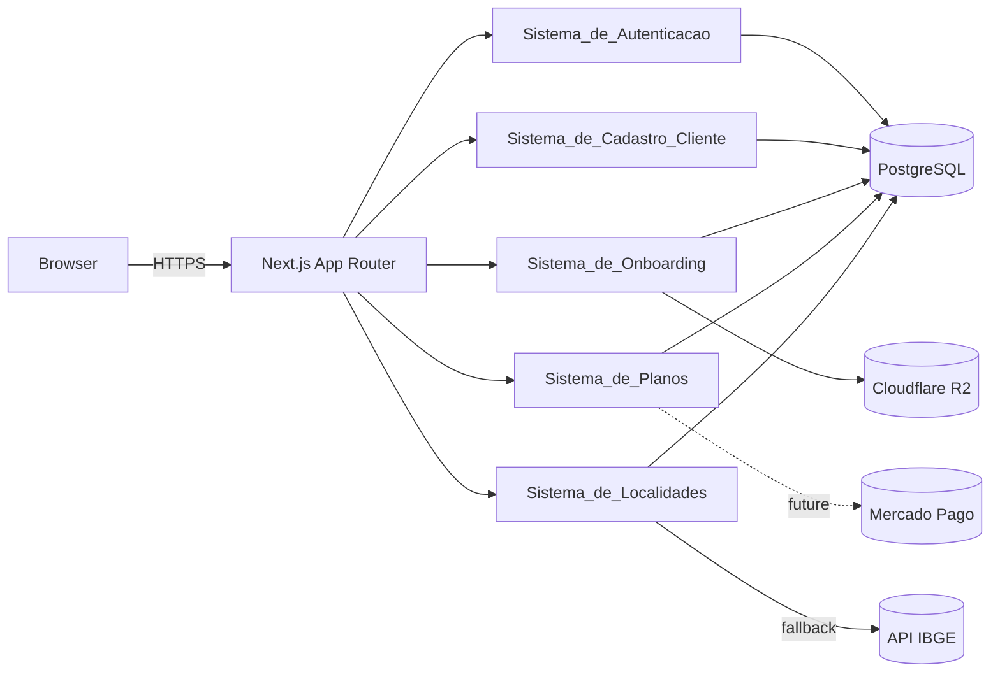
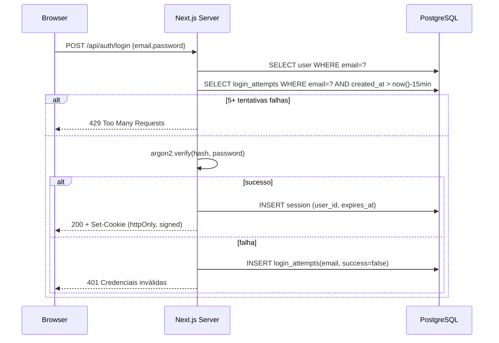
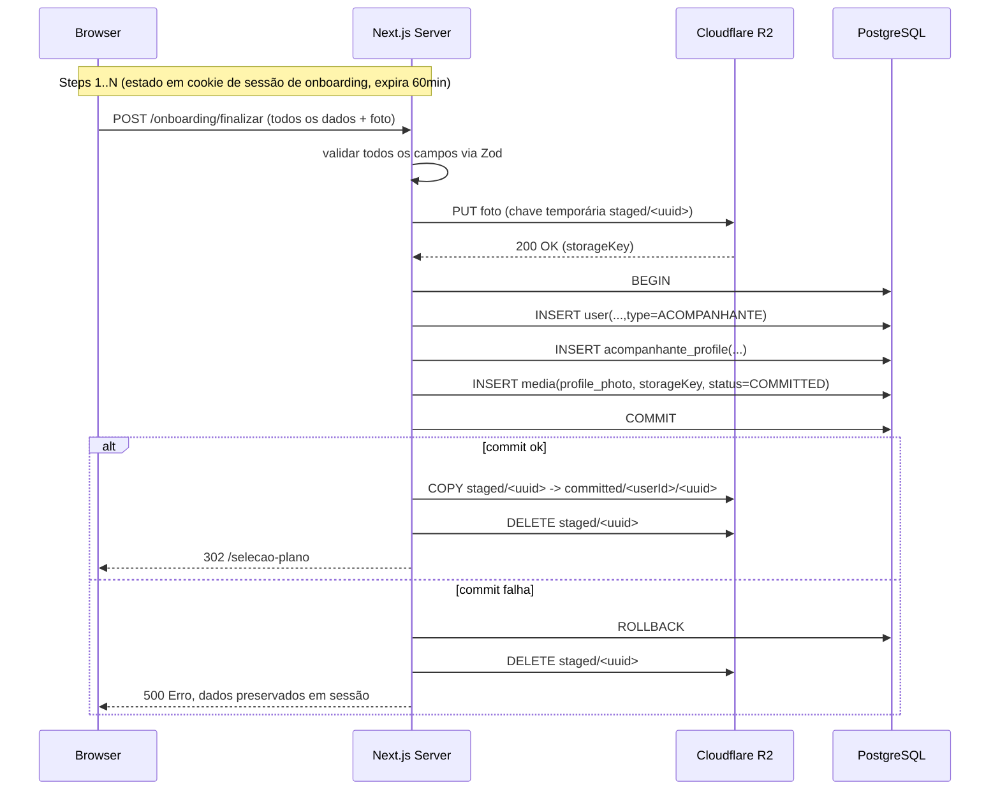
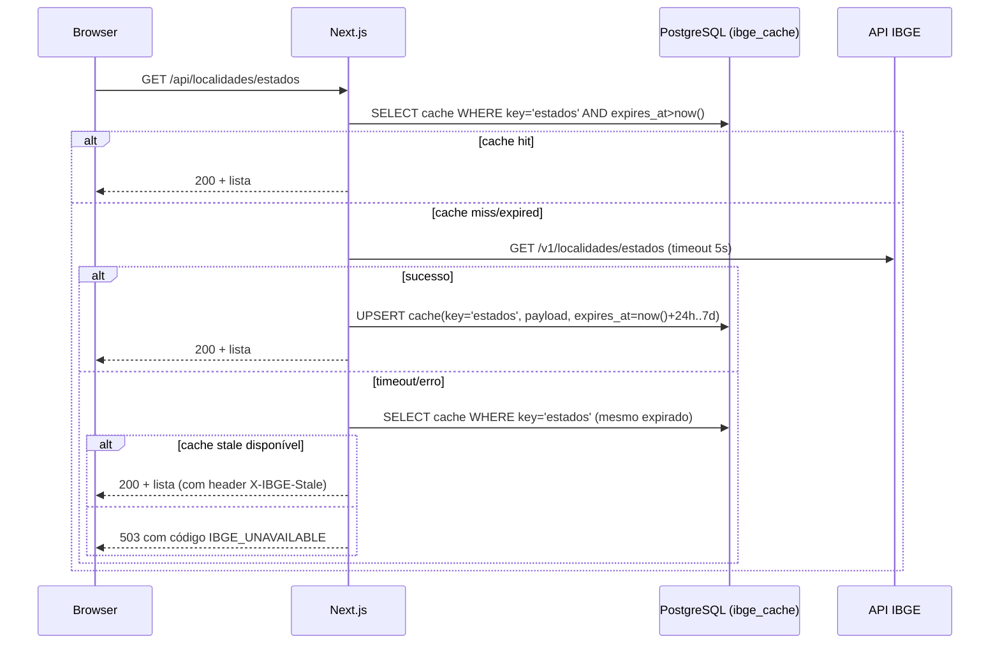
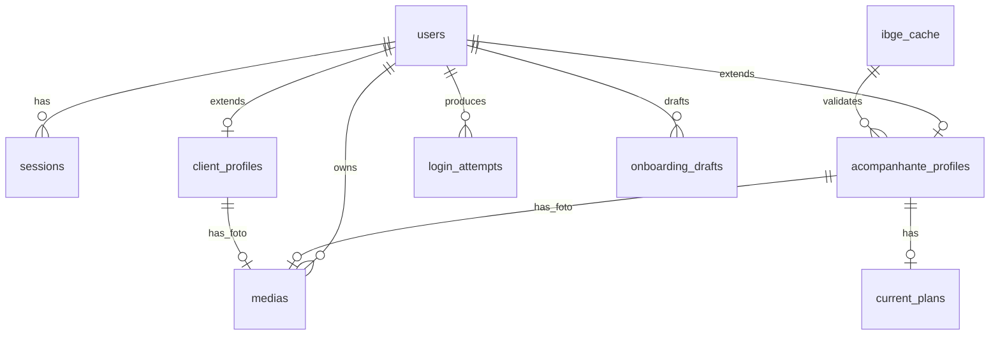

# Design Document

## Overview

A Privello é uma aplicação web full-stack construída com Next.js (App Router) e PostgreSQL, projetada para entregar dois fluxos principais no MVP: cadastro/login de Clientes e Acompanhantes, e onboarding em etapas + Seleção de Plano para Acompanhantes. O design prioriza:

- **Atomicidade de cadastros complexos** (Onboarding_Acompanhante envolve banco de dados + storage de mídia em R2 e precisa ser tudo-ou-nada).
- **Segurança de credenciais** (hash de senha resistente, sessões com expiração e revogação, rate limiting por email).
- **Isolamento de dependências externas** (Cloudflare R2, Mercado Pago, API_IBGE confinadas em módulos com interface estável).
- **Reutilização de UI** via uma Biblioteca_de_Componentes desacoplada do domínio.
- **Paridade entre ambientes** com Docker local e deploy no Railway usando a mesma imagem.

### Decisões Técnicas

| Área | Escolha | Justificativa |
| --- | --- | --- |
| Framework | Next.js 15 (App Router) + TypeScript | Stack alvo definida nos requisitos; Server Actions/Route Handlers cobrem APIs do MVP sem servidor separado. |
| Banco | PostgreSQL 16 | Definido no requisito 7. |
| ORM | Prisma | Migrations declarativas, transações atômicas (`$transaction`), tipagem ponta a ponta. |
| Hash de senha | argon2id | Vencedor da PHC, parametrizável, considerado estado da arte para hash de senha (Requirement 1.4). |
| Sessões | Cookie HTTP-only assinado + tabela `sessions` no Postgres | Permite revogação real (logout), expiração configurável, rate limit e auditoria — exigências do Requirement 1. |
| Validação | Zod | Schemas reutilizáveis para form, server action e camada de domínio. |
| Storage de mídia | Cloudflare R2 via SDK S3-compatível, isolado em `lib/storage/r2.ts` | Requirement 7.7 exige confinamento. |
| Pagamentos | Mercado Pago, isolado em `lib/payments/mercadopago.ts` | Requirement 7.8 exige confinamento. Não usado no MVP, mas o módulo existe como hook para evolução. |
| Cache de IBGE | Tabela `ibge_cache` no Postgres + camada em memória por processo | Atende requisitos de TTL (24h–7d) e fallback offline sem depender de Redis no MVP. |
| Estilização | Tailwind CSS + Design Tokens centralizados | Suporta a Biblioteca_de_Componentes consistente (Requirement 6.6). |
| Containers | Dockerfile multi-stage + docker-compose para dev | Requirement 7.1, 7.2, 7.6. |
| Deploy | Railway lendo o mesmo Dockerfile | Requirement 7.6. |

### Resumo da Arquitetura em Alto Nível



## Architecture

### Estrutura de Pastas

```
privello/
├── docker/
│   ├── Dockerfile
│   └── docker-compose.yml
├── prisma/
│   ├── schema.prisma
│   └── migrations/
├── public/
├── src/
│   ├── app/                         # Next.js App Router
│   │   ├── (public)/
│   │   │   ├── login/
│   │   │   ├── cadastro/
│   │   │   │   ├── cliente/
│   │   │   │   └── acompanhante/    # Onboarding multi-step
│   │   │   └── page.tsx
│   │   ├── (acompanhante)/
│   │   │   ├── selecao-plano/
│   │   │   └── perfil/
│   │   ├── (cliente)/
│   │   └── api/
│   │       ├── auth/
│   │       ├── localidades/
│   │       └── health/
│   ├── components/                  # Biblioteca_de_Componentes
│   │   ├── primitives/              # Card, Input, Button, Select
│   │   ├── tokens.ts                # Design tokens
│   │   └── index.ts
│   ├── domain/                      # Regras puras (validação, cálculos)
│   │   ├── auth/
│   │   ├── identifier/
│   │   ├── plano/
│   │   └── onboarding/
│   ├── server/                      # Camada de aplicação (server-only)
│   │   ├── auth/
│   │   ├── cadastro-cliente/
│   │   ├── onboarding/
│   │   ├── planos/
│   │   └── localidades/
│   ├── lib/
│   │   ├── storage/r2.ts            # Único ponto de contato com R2
│   │   ├── payments/mercadopago.ts  # Único ponto de contato com MP
│   │   ├── db.ts                    # Cliente Prisma
│   │   ├── env.ts                   # Validação de env vars na boot
│   │   └── ibge.ts                  # Cliente da API IBGE
│   └── middleware.ts                # Proteção de rotas autenticadas
├── tests/
│   ├── unit/
│   ├── property/
│   └── integration/
├── .env.example
└── package.json
```

### Camadas

1. **Apresentação (`src/app`, `src/components`)**: rotas Next.js (Server Components + Client Components quando necessário) e Biblioteca_de_Componentes. Não conhece banco nem R2.
2. **Aplicação (`src/server`)**: orquestra casos de uso (registrar cliente, completar onboarding, selecionar plano). Server Actions e Route Handlers entram aqui. Faz transações, controla atomicidade, traduz erros de domínio para respostas HTTP.
3. **Domínio (`src/domain`)**: funções puras de validação (identificador, telefone, email, descrição), regras de plano, regras de senha. Sem I/O. É a camada mais coberta por testes property-based.
4. **Infraestrutura (`src/lib`)**: cliente Prisma, cliente R2, cliente Mercado Pago, cliente IBGE. Adapters cuja interface o resto da aplicação consome.

### Fluxo de Autenticação



### Fluxo de Onboarding Atômico



A foto é gravada primeiro em prefixo `staged/`. Se a transação no banco falhar, o objeto staged é apagado. Se a transação tiver sucesso, o objeto é movido para `committed/`. Esse padrão entrega a semântica "tudo ou nada" exigida pelo Requirement 3.5/3.6 mesmo que o storage não participe da transação SQL.

### Fluxo de Localidades



### Proteção de Rotas

`src/middleware.ts` lê o cookie de sessão, valida assinatura/expiração via tabela `sessions`, e injeta `x-user-id`/`x-user-type` em headers internos. Rotas em `(acompanhante)` exigem `type=ACOMPANHANTE` e `plano_vigente IS NOT NULL` (exceto `/selecao-plano`). Rotas em `(cliente)` exigem `type=CLIENTE`.

## Components and Interfaces

### Sistema_de_Autenticacao (`src/server/auth`)

Responsabilidades: hash de senha, login, logout, criação/expiração/revogação de sessão, rate limiting por email.

```ts
// src/server/auth/types.ts
export type UserType = "CLIENTE" | "ACOMPANHANTE";

export type Session = {
  id: string;            // uuid (também é o token, opaco)
  userId: string;
  userType: UserType;
  expiresAt: Date;       // <= 30 dias após criação
  revokedAt: Date | null;
};

export type AuthResult =
  | { ok: true; session: Session }
  | { ok: false; reason: "INVALID_CREDENTIALS" | "RATE_LIMITED" };

export interface AuthService {
  hashPassword(plain: string): Promise<string>;
  verifyPassword(plain: string, hash: string): Promise<boolean>;
  login(email: string, password: string): Promise<AuthResult>;
  logout(sessionId: string): Promise<void>;
  resolveSession(sessionId: string): Promise<Session | null>;
}
```

Notas de implementação:

- `hashPassword` usa `argon2id` (parâmetros: `memoryCost=19456`, `timeCost=2`, `parallelism=1`).
- `login` é envolto em uma transação que lê `login_attempts` dos últimos 15 minutos. Se contagem de falhas para o mesmo email ≥ 5, retorna `RATE_LIMITED` e nem chega a verificar a senha (Requirement 1.8).
- Cookie de sessão: `Secure`, `HttpOnly`, `SameSite=Lax`, valor é o `session.id` (UUID v4) assinado por HMAC com `SESSION_SECRET`.
- `resolveSession` rejeita se `revokedAt` não nulo ou `expiresAt` passou; também atualiza `last_seen_at` para auditoria leve.

### Sistema_de_Cadastro_Cliente (`src/server/cadastro-cliente`)

```ts
export type CadastroClienteInput = {
  nome: string;
  email: string;
  identificador: string; // será normalizado para lower-case
  senha: string;
  fotoPerfil?: {        // opcional; mesmas regras do Onboarding_Acompanhante
    mimeType: string;   // image/jpeg | image/png | image/webp
    sizeBytes: number;  // <= 10 MB
    stagedKey: string;  // devolvido por POST /api/cadastro/cliente/foto
  };
};

export type CadastroClienteResult =
  | { ok: true; userId: string; sessionId: string }
  | {
      ok: false;
      reason:
        | "EMAIL_EM_USO"
        | "IDENTIFICADOR_EM_USO"
        | "VALIDACAO"
      ;
      detalhes?: Record<string, string>;
    };

export interface CadastroClienteService {
  registrar(input: CadastroClienteInput): Promise<CadastroClienteResult>;
}
```

Fluxo:

1. Validação Zod (nome 2..100 trim, email 5..254 + regex, identificador 3..30 `[A-Za-z0-9_]`, senha 8..128, `fotoPerfil` opcional com as mesmas regras de MIME/tamanho do Onboarding_Acompanhante — reusa o `fotoPerfilSchema` em `src/domain/schemas.ts`).
2. Normaliza `identificador` para lower-case e `email` para lower-case.
3. Em transação atômica: verifica unicidade de email e identificador; insere `users` (com hash argon2) + `client_profiles`; quando há `fotoPerfil`, insere `medias(isProfilePhoto=true, status=COMMITTED)` com `storageKey = committed/<userId>/profile.<ext>` e atualiza `client_profiles.foto_perfil_id`; cria sessão e retorna `sessionId` para o handler colocar no cookie (Requirement 2.10).
4. Pós-commit (fora da transação): quando há foto, copia `staged/<uuid>` → `committed/<userId>/profile.<ext>` em R2 e apaga o staged (helper `commitProfilePhoto` em `src/server/storage/profileMedia.ts`, compartilhado com `Sistema_de_Onboarding.finalizar`). Em falha persistente, marca `Media.status = PENDING_REPAIR` em best-effort. Em qualquer falha de transação, o staged é apagado por `cleanupStaged` (Property 15 estendida ao Cliente).

### Sistema_de_Onboarding (`src/server/onboarding`)

```ts
export type OnboardingState = {
  onboardingId: string; // uuid; armazenado em cookie httpOnly de curta vida
  step: 1 | 2 | 3 | 4 | 5;
  data: Partial<OnboardingData>;
  updatedAt: Date;      // expira após 60min de inatividade
};

export type OnboardingData = {
  nome: string;
  email: string;
  identificador: string;
  senha: string;
  telefone: string;     // armazenado normalizado: somente dígitos com DDD
  estadoSigla: string;  // validado contra IBGE
  cidadeNome: string;   // validado contra IBGE para o estado escolhido
  descricao: string;    // 1..1000
  fotoPerfil: {
    mimeType: "image/jpeg" | "image/png" | "image/webp";
    sizeBytes: number;  // <= 10*1024*1024
    stagedKey: string;  // chave em R2 prefixo staged/
  };
};

export interface OnboardingService {
  iniciar(): Promise<OnboardingState>;
  atualizarEtapa(
    onboardingId: string,
    etapa: number,
    patch: Partial<OnboardingData>,
  ): Promise<OnboardingState>;
  uploadFoto(
    onboardingId: string,
    file: { mimeType: string; bytes: Buffer },
  ): Promise<{ stagedKey: string }>;
  finalizar(onboardingId: string): Promise<
    | { ok: true; userId: string; sessionId: string }
    | { ok: false; reason: "VALIDACAO" | "EMAIL_EM_USO" | "IDENTIFICADOR_EM_USO" | "PERSISTENCIA" }
  >;
  descartar(onboardingId: string): Promise<void>;
}
```

Estado parcial é mantido na tabela `onboarding_drafts` (não em sessão de browser) com `expires_at = updated_at + 60min`. Um job leve (cron simples ou limpeza preguiçosa em cada acesso) apaga drafts expirados e os objetos `staged/` correspondentes.

`finalizar`:

1. Recarrega draft, verifica não expirado.
2. Revalida todos os campos.
3. Revalida estado/cidade contra `Sistema_de_Localidades` (Requirement 4.3).
4. Em `prisma.$transaction`:
   - INSERT em `users` (type=ACOMPANHANTE).
   - INSERT em `acompanhante_profiles`.
   - INSERT em `medias` (foto de perfil, com `storage_key` apontando para o destino final).
   - DELETE do draft.
5. Após commit: COPY no R2 de `staged/...` para `committed/<userId>/profile.<ext>`, DELETE do staged.
6. Se qualquer passo até o commit falhar: ROLLBACK + DELETE do objeto staged.
7. Se a COPY pós-commit falhar: marca `medias.status=PENDING_REPAIR` e dispara retry idempotente (operação compensatória; o usuário ainda vai para `/selecao-plano` se desejado, mas como o MVP exige consistência, optamos por bloquear: a transação só commit se a COPY já tiver ocorrido — ver alternativa na seção Error Handling).

### Sistema_de_Planos (`src/server/planos`)

```ts
export type PlanoTipo = "BASICO" | "PREMIUM";

export type PlanoDefinition = {
  tipo: PlanoTipo;
  limiteMidias: number;       // 10 ou 50
  permiteStories: boolean;    // false / true
  prioridadeBusca: boolean;   // false / true
  permiteAudio: boolean;      // false (Basico) / true (Premium)
};

export interface PlanoService {
  listar(): PlanoDefinition[];
  selecionar(
    acompanhanteId: string,
    tipo: PlanoTipo,
  ): Promise<
    | { ok: true }
    | { ok: false; reason: "INVALIDO" | "PERSISTENCIA" }
  >;
  obterVigente(acompanhanteId: string): Promise<PlanoDefinition | null>;
}
```

`PLANO_DEFINITIONS` é constante imutável — única fonte de verdade dos limites do Requirement 5.2/5.3.

### Sistema_de_Localidades (`src/server/localidades` + `src/lib/ibge.ts`)

```ts
export type Estado = { sigla: string; nome: string };
export type Cidade = { id: number; nome: string; estadoSigla: string };

export interface LocalidadesService {
  listarEstados(): Promise<{ ok: true; estados: Estado[]; stale: boolean } | { ok: false }>;
  listarCidades(estadoSigla: string): Promise<{ ok: true; cidades: Cidade[]; stale: boolean } | { ok: false }>;
  validar(estadoSigla: string, cidadeNome: string): Promise<boolean>;
}
```

Cache: tabela `ibge_cache (key TEXT PK, payload JSONB, fetched_at TIMESTAMPTZ, expires_at TIMESTAMPTZ)`. TTL configurável via env, default 72h, mínimo 24h, máximo 7d (Requirement 4.5). Camada em memória de processo segura entre requests do mesmo container, invalidada pelo `expires_at`.

### Biblioteca_de_Componentes (`src/components/primitives`)

Cada componente expõe:

- Props tipadas com TypeScript.
- JSDoc em cada prop pública (Requirement 6.3).
- Estados: `disabled` (todos), `loading` (Button), `error`/`errorMessage` (Input, Select).
- Sem props que carreguem nomes de domínio (`cliente`, `acompanhante`, `plano`).

```ts
// src/components/primitives/Button.tsx
export type ButtonVariant = "primary" | "secondary" | "ghost" | "danger";
export type ButtonSize = "sm" | "md" | "lg";

/** Botão primitivo da Biblioteca_de_Componentes. */
export interface ButtonProps extends React.ButtonHTMLAttributes<HTMLButtonElement> {
  /** Variante visual do botão. */
  variant?: ButtonVariant;
  /** Tamanho do botão. */
  size?: ButtonSize;
  /** Quando true, mostra spinner e desabilita o clique. */
  loading?: boolean;
  /** Quando true, desabilita interação e aplica estilo desabilitado. */
  disabled?: boolean;
  /** Conteúdo do botão. */
  children: React.ReactNode;
}
```

Design tokens em `src/components/tokens.ts` exportam paleta, tipografia e escala de espaçamento; `tailwind.config.ts` lê esses tokens para garantir consistência (Requirement 6.6).

Um teste estático (lint customizado ou simples script) verifica que nenhum nome de prop em `primitives/*` contém `cliente`, `acompanhante`, `plano`, etc. (Requirement 6.5).

### Ambiente_de_Execucao

`docker/Dockerfile` (multi-stage):

```dockerfile
FROM node:20-alpine AS deps
WORKDIR /app
COPY package.json package-lock.json ./
RUN npm ci

FROM node:20-alpine AS build
WORKDIR /app
COPY --from=deps /app/node_modules ./node_modules
COPY . .
RUN npx prisma generate && npm run build

FROM node:20-alpine AS runtime
WORKDIR /app
ENV NODE_ENV=production
ENV PORT=3000
COPY --from=build /app/.next ./.next
COPY --from=build /app/public ./public
COPY --from=build /app/node_modules ./node_modules
COPY --from=build /app/package.json ./package.json
COPY --from=build /app/prisma ./prisma
EXPOSE 3000
CMD ["sh", "-c", "node ./scripts/check-env.js && npx prisma migrate deploy && npm run start -- -p ${PORT:-3000}"]
```

`docker/docker-compose.yml`:

```yaml
services:
  app:
    build:
      context: ..
      dockerfile: docker/Dockerfile
    env_file: ../.env.local
    ports: ["3000:3000"]
    depends_on: [db]
  db:
    image: postgres:16-alpine
    environment:
      POSTGRES_USER: privello
      POSTGRES_PASSWORD: privello
      POSTGRES_DB: privello
    volumes:
      - privello_pgdata:/var/lib/postgresql/data
    ports: ["5432:5432"]
volumes:
  privello_pgdata:
```

`scripts/check-env.js` valida o conjunto de variáveis em `.env.example` e aborta com `process.exit(1)` listando as ausentes (Requirement 7.5). `lib/env.ts` faz a mesma validação em runtime via Zod no startup do Next, antes de aceitar requisições.

Variáveis em `.env.example`:

```
DATABASE_URL=postgresql://privello:privello@db:5432/privello
SESSION_SECRET=change-me
PORT=3000

R2_ACCOUNT_ID=
R2_ACCESS_KEY_ID=
R2_SECRET_ACCESS_KEY=
R2_BUCKET=
R2_PUBLIC_BASE_URL=

MP_ACCESS_TOKEN=
MP_ENVIRONMENT=sandbox

IBGE_BASE_URL=https://servicodados.ibge.gov.br/api
IBGE_CACHE_TTL_HOURS=72
```

`.env` e `.env.local` ficam no `.gitignore` (Requirement 7.3).

## Data Models



### Tabelas Principais

```prisma
// prisma/schema.prisma (resumo conceitual)

model User {
  id              String   @id @default(uuid())
  email           String   @unique         // armazenado em lower-case
  identificador   String   @unique         // armazenado em lower-case
  nome            String
  passwordHash    String
  type            UserType
  createdAt       DateTime @default(now())
  updatedAt       DateTime @updatedAt
  acompanhante    AcompanhanteProfile?
  client          ClientProfile?
  sessions        Session[]
  medias          Media[]
}

enum UserType { CLIENTE ACOMPANHANTE }

model ClientProfile {
  userId        String  @id
  user          User    @relation(fields: [userId], references: [id], onDelete: Cascade)
  fotoPerfilId  String? @unique
  fotoPerfil    Media?  @relation("ClientFotoDePerfil", fields: [fotoPerfilId], references: [id])
}

model AcompanhanteProfile {
  userId        String  @id
  user          User    @relation(fields: [userId], references: [id], onDelete: Cascade)
  telefone      String  // somente dígitos
  estadoSigla   String  // 2 letras
  cidadeNome    String
  descricao     String  // 1..1000
  fotoPerfilId  String? @unique
  fotoPerfil    Media?  @relation("FotoDePerfil", fields: [fotoPerfilId], references: [id])
  planoVigente  PlanoTipo?  // null até Selecao_de_Plano
  planoSelecionadoEm DateTime?
}

enum PlanoTipo { BASICO PREMIUM }

model Media {
  id          String   @id @default(uuid())
  ownerId     String
  owner       User     @relation(fields: [ownerId], references: [id], onDelete: Cascade)
  storageKey  String   @unique  // chave no R2 (committed/...)
  mimeType    String
  sizeBytes   Int
  status      MediaStatus
  isProfilePhoto Boolean @default(false)
  createdAt   DateTime @default(now())
  acompanhanteAsProfile AcompanhanteProfile? @relation("FotoDePerfil")
}

enum MediaStatus { COMMITTED PENDING_REPAIR DELETED }

model Session {
  id         String   @id @default(uuid())
  userId     String
  user       User     @relation(fields: [userId], references: [id], onDelete: Cascade)
  createdAt  DateTime @default(now())
  expiresAt  DateTime          // <= createdAt + 30 dias
  revokedAt  DateTime?
  lastSeenAt DateTime @default(now())
  @@index([userId])
  @@index([expiresAt])
}

model LoginAttempt {
  id        String   @id @default(uuid())
  email     String   // lower-case
  success   Boolean
  createdAt DateTime @default(now())
  @@index([email, createdAt])
}

model OnboardingDraft {
  id         String   @id @default(uuid())
  payload    Json     // dados parciais (sem senha em claro pós-validação final)
  stagedKey  String?  // chave R2 prefixo staged/ se já houve upload
  createdAt  DateTime @default(now())
  updatedAt  DateTime @updatedAt
  expiresAt  DateTime          // updatedAt + 60min
  @@index([expiresAt])
}

model IbgeCacheEntry {
  key        String   @id     // ex: "estados", "cidades:SP"
  payload    Json
  fetchedAt  DateTime @default(now())
  expiresAt  DateTime
}
```

### Invariantes

- `users.email` e `users.identificador` sempre em lower-case.
- `users.passwordHash` nunca contém senha em claro nem MD5/SHA simples — sempre prefixo argon2 (`$argon2id$...`).
- `acompanhante_profiles.fotoPerfilId` e `medias.isProfilePhoto = true` são consistentes (referenciam o mesmo registro).
- `acompanhante_profiles.planoVigente = NULL` ⇒ acesso a rotas de Acompanhante autenticada bloqueado (exceto `/selecao-plano`).
- `sessions.expiresAt` ≤ `createdAt + 30 dias`.
- `onboarding_drafts.expiresAt` = `updatedAt + 60 min`.
- `ibge_cache.expiresAt` ∈ `[fetchedAt + 24h, fetchedAt + 7d]`.


## Correctness Properties

*A property is a characteristic or behavior that should hold true across all valid executions of a system — essentially, a formal statement about what the system should do. Properties serve as the bridge between human-readable specifications and machine-verifiable correctness guarantees.*

As propriedades abaixo derivam diretamente da prework de testabilidade. Foram consolidadas para evitar redundâncias (por exemplo, regras de validação de campo agrupadas, e ciclos de vida de sessão expressos como uma única invariante).

### Property 1: Hash de senha é round-trip e nunca expõe a senha em claro

*For any* senha em texto claro `p` e qualquer hash `h = hashPassword(p)`, deve valer simultaneamente: `verifyPassword(p, h) === true`, `h` começa com o prefixo `$argon2id$`, e para qualquer outra senha `p' != p`, `verifyPassword(p', h) === false`.

**Validates: Requirements 1.4**

### Property 2: Credenciais inválidas produzem resposta indistinguível

*For any* tentativa de login com (a) email inexistente e qualquer senha, ou (b) email existente e senha incorreta, fora de bloqueio por rate limit, o resultado retornado é exatamente `{ ok: false, reason: "INVALID_CREDENTIALS" }`, idêntico em ambos os casos.

**Validates: Requirements 1.2, 1.3**

### Property 3: Login bem-sucedido cria sessão dentro do limite de 30 dias

*For any* usuário cadastrado com email `e` e senha `p`, e para qualquer relógio `t`, `login(e, p)` realizado em `t` produz uma `Session` com `expiresAt > t` e `expiresAt <= t + 30 dias` e `revokedAt === null` e `userType` igual ao tipo persistido do usuário.

**Validates: Requirements 1.1**

### Property 4: Ciclo de vida da sessão é consistente

*For any* sessão `s` e qualquer instante `t`, `resolveSession(s.id)` retorna a sessão (com seu `userType` original) se e somente se `t >= s.createdAt`, `t < s.expiresAt` e `s.revokedAt === null`. Caso contrário, retorna `null`. Em particular, após `logout(s.id)`, qualquer chamada subsequente a `resolveSession(s.id)` retorna `null`.

**Validates: Requirements 1.5, 1.6, 1.7**

### Property 5: Rate limit por email aplica corte exato em 5 falhas em 15 minutos

*For any* email `e` e qualquer histórico de tentativas `H`, definindo `n` como a contagem de falhas em `H` cuja idade é menor que 15 minutos, a próxima tentativa de `login(e, _)` retorna `{ ok: false, reason: "RATE_LIMITED" }` se `n >= 5` e, caso contrário, segue o caminho normal de verificação de credenciais.

**Validates: Requirements 1.8**

### Property 6: Validação de campos do cadastro de Cliente

*For any* `CadastroClienteInput`, `registrar(input)` retorna `{ ok: false, reason: "VALIDACAO" }` se e somente se ao menos uma das condições a seguir é falsa:
- `nome.trim().length` está em `[2, 100]`,
- `email.length` está em `[5, 254]` e o email satisfaz o padrão `parte_local@dominio` com pelo menos um ponto no domínio,
- `identificador` casa com `^[A-Za-z0-9_]{3,30}$`,
- `senha.length` está em `[8, 128]`.

**Validates: Requirements 2.1, 2.5, 2.6, 2.7, 2.8, 2.9**

### Property 7: Cadastro de Cliente válido é round-trip e cria sessão

*For any* `CadastroClienteInput` válido, após `registrar(input) = { ok: true, userId, sessionId }`, ler o usuário pelo `userId` retorna `{ email: input.email.toLowerCase(), identificador: input.identificador.toLowerCase(), nome: input.nome.trim(), type: "CLIENTE" }`, e `resolveSession(sessionId)` retorna uma sessão válida com `userType === "CLIENTE"`.

**Validates: Requirements 2.2, 2.10**

### Property 8: Unicidade de email é case-insensitive

*For any* dois cadastros com emails `a` e `b` tais que `a.toLowerCase() === b.toLowerCase()`, no máximo um deles termina em sucesso; o segundo recebe `{ ok: false, reason: "EMAIL_EM_USO" }`.

**Validates: Requirements 2.3**

### Property 9: Unicidade de identificador é case-insensitive

*For any* dois cadastros com identificadores `a` e `b` tais que `a.toLowerCase() === b.toLowerCase()`, no máximo um deles termina em sucesso; o segundo recebe `{ ok: false, reason: "IDENTIFICADOR_EM_USO" }`.

**Validates: Requirements 2.4**

### Property 10: Validação do telefone brasileiro

*For any* string `s`, definindo `digitos = s` com todas as ocorrências de `+`, espaço, `(`, `)` e `-` removidas, `validarTelefone(s)` é `true` se e somente se `digitos` consiste apenas em dígitos decimais e `digitos.length` é 10 ou 11.

**Validates: Requirements 3.8**

### Property 11: Validação da descrição

*For any* string `d`, `validarDescricao(d)` é `true` se e somente se `d.length` está em `[1, 1000]`.

**Validates: Requirements 3.9**

### Property 12: Validação da Foto_de_Perfil

*For any* arquivo com `mimeType` e `sizeBytes`, `validarFotoPerfil(arquivo)` é `true` se e somente se `mimeType ∈ {"image/jpeg", "image/png", "image/webp"}` e `sizeBytes <= 10 * 1024 * 1024`.

**Validates: Requirements 3.10**

### Property 13: Estado parcial do onboarding é preservado entre etapas

*For any* sequência de chamadas `atualizarEtapa(onboardingId, etapaᵢ, patchᵢ)` realizadas dentro de 60 minutos sem descarte, o estado lido subsequentemente é a mescla de todos os `patchᵢ` na ordem aplicada (último valor por chave vence), e nenhum patch é perdido ao navegar para uma etapa anterior.

**Validates: Requirements 3.2**

### Property 14: Drafts de onboarding expiram após 60 minutos de inatividade

*For any* draft com `updatedAt = u`, e qualquer instante `t > u + 60 minutos`, qualquer operação de leitura/atualização do draft falha como expirada e o sistema descarta o draft, removendo o objeto staged em R2 quando existir, sem criar conta nem reservar identificador.

**Validates: Requirements 3.3, 3.4**

### Property 15: Atomicidade do onboarding (tudo ou nada)

*For any* execução de `finalizar(onboardingId)`, o estado final do sistema (banco de dados + storage de mídia) é equivalente a um dos dois cenários:
- **Sucesso**: existem `users` (type=ACOMPANHANTE), `acompanhante_profiles`, `medias.isProfilePhoto=true` referenciando um objeto em `committed/<userId>/...`, o draft foi removido, e nenhum objeto em `staged/` permanece para esse onboarding.
- **Falha**: não existe `users`/`acompanhante_profiles`/`medias` criados por esta execução, nenhum objeto em `staged/` ou `committed/` permanece para este onboarding, o draft permanece consultável (até expirar), e uma nova chamada a `finalizar` é permitida.

**Validates: Requirements 3.5, 3.6**

### Property 16: Onboarding reusa as regras de validação do cadastro

*For any* tentativa de `finalizar(onboardingId)`, ela falha com `{ ok: false, reason: "VALIDACAO" }` se e somente se algum dos campos do draft viola as regras unificadas de email/identificador/senha/nome/telefone/descrição/foto definidas pelas Properties 6, 10, 11 e 12, ou um campo obrigatório está ausente.

**Validates: Requirements 3.1, 3.7, 3.12**

### Property 17: Listagem de estados sempre retorna 27 UFs

*For any* chamada a `listarEstados()` em qualquer estado de cache (vazio, válido ou expirado) com a API do IBGE respondendo conforme contrato, o resultado contém exatamente 27 unidades federativas, com `sigla` de 2 letras maiúsculas distintas.

**Validates: Requirements 4.1**

### Property 18: Cidades retornadas pertencem ao estado consultado

*For any* sigla de estado `uf` válida, todas as cidades retornadas por `listarCidades(uf)` têm `estadoSigla === uf`.

**Validates: Requirements 4.2**

### Property 19: Validação de localidade aceita exatamente o produto cartesiano oficial

*For any* par `(uf, cidade)`, `validar(uf, cidade)` é `true` se e somente se `uf` está em `listarEstados()` e `cidade` está (com igualdade exata de nome) em `listarCidades(uf)`.

**Validates: Requirements 4.3**

### Property 20: Comportamento determinístico do fallback do IBGE

*For any* combinação de estado de cache (`AUSENTE | VALIDO | EXPIRADO`) e comportamento da API IBGE (`OK | TIMEOUT | ERRO`), `listarEstados()`/`listarCidades(uf)` segue exatamente esta tabela:
- cache `VALIDO` ⇒ retorna cache, `stale=false`, **não chama IBGE**.
- cache `AUSENTE` ou `EXPIRADO`, IBGE `OK` ⇒ retorna IBGE e atualiza cache.
- cache `AUSENTE` ou `EXPIRADO`, IBGE `TIMEOUT|ERRO`, cache `EXPIRADO` disponível ⇒ retorna cache antigo com `stale=true`.
- cache `AUSENTE`, IBGE `TIMEOUT|ERRO` ⇒ retorna `{ ok: false }`, e o cliente pode tentar até 3 vezes sem perda de dados de onboarding.

**Validates: Requirements 4.4, 4.5**

### Property 21: TTL do cache IBGE está sempre no intervalo permitido

*For any* entrada de `ibge_cache` recém-gravada, `expiresAt - fetchedAt` está no intervalo `[24h, 7 dias]`.

**Validates: Requirements 4.5**

### Property 22: Definições de plano refletem fielmente os requisitos

*For any* leitura de `PLANO_DEFINITIONS`, o conjunto retornado é exatamente `{BASICO, PREMIUM}` e satisfaz: `BASICO.limiteMidias === 10`, `BASICO.permiteStories === false`, `BASICO.prioridadeBusca === false`, `BASICO.permiteAudio === false`, `PREMIUM.limiteMidias === 50`, `PREMIUM.permiteStories === true`, `PREMIUM.prioridadeBusca === true`, `PREMIUM.permiteAudio === true`.

**Validates: Requirements 5.1, 5.2, 5.3**

### Property 23: Seleção de plano é round-trip persistente

*For any* `acompanhanteId` existente e `tipo ∈ {BASICO, PREMIUM}`, após `selecionar(acompanhanteId, tipo) = { ok: true }`, `obterVigente(acompanhanteId)` retorna o `PlanoDefinition` correspondente a `tipo`. Antes de qualquer seleção bem-sucedida, `obterVigente(acompanhanteId)` retorna `null`.

**Validates: Requirements 5.4, 5.6**

### Property 24: Seleção inválida é rejeitada e mantém estado

*For any* string `s` que não pertence a `{"BASICO", "PREMIUM"}`, `selecionar(acompanhanteId, s)` retorna `{ ok: false, reason: "INVALIDO" }` e `obterVigente(acompanhanteId)` permanece `null` (caso o acompanhante ainda não tivesse plano).

**Validates: Requirements 5.8**

### Property 25: Falhas de persistência mantêm o acompanhante sem plano e permitem retentativa

*For any* sequência de tentativas de `selecionar(acompanhanteId, tipo)` em que falhas de persistência ocorrem em qualquer subconjunto das tentativas, enquanto não houver tentativa bem-sucedida, `obterVigente(acompanhanteId)` continua `null`; assim que ocorre uma chamada bem-sucedida, `obterVigente` passa a retornar o plano correspondente.

**Validates: Requirements 5.9**

### Property 26: Acesso a áreas de Acompanhante depende do plano vigente

*For any* requisição autenticada com `userType === "ACOMPANHANTE"` para uma rota em `(acompanhante)/*`, se `planoVigente === null` e a rota não é `/selecao-plano`, o middleware emite redirecionamento para `/selecao-plano`. Se `planoVigente !== null`, requisições para `/selecao-plano` redirecionam para a área autenticada principal.

**Validates: Requirements 5.5, 5.10**

### Property 27: Foto de Perfil não conta no limite de mídias do plano

*For any* acompanhante com plano `P` e qualquer conjunto de mídias armazenadas, a contagem de mídias relevante para o limite do plano é `count(medias where ownerId = acompanhanteId AND isProfilePhoto = false)`, e adicionar/remover a `Foto_de_Perfil` não altera essa contagem.

**Validates: Requirements 5.7**

### Property 28: Componentes primitivos refletem props de estado em atributos DOM

*For any* combinação de props (`disabled`, `loading` quando aplicável, `error` quando aplicável) renderizada em `Button`, `Input`, `Select` e `Card`:
- `disabled === true` ⇒ atributo `disabled` (ou `aria-disabled="true"` em `Card`) está presente no elemento raiz.
- Em `Button`, `loading === true` ⇒ `aria-busy="true"` e o botão está efetivamente desabilitado.
- Em `Input` e `Select`, `error` truthy ⇒ `aria-invalid="true"` e a mensagem de erro é renderizada acessível ao screen reader.

**Validates: Requirements 6.4**

### Property 29: Componentes primitivos não vazam nomes do domínio

*For any* componente exportado de `src/components/primitives/*`, o conjunto de nomes de props públicas (incluindo nomes em uniões discriminadas) não contém, por substring case-insensitive, nenhum dos termos `cliente`, `acompanhante`, `plano`, `basico`, `premium`.

**Validates: Requirements 6.5**

### Property 30: `.env.example` é o conjunto exato de variáveis lidas em runtime

*For any* execução, o conjunto `LIDAS` de chaves consultadas pelo schema Zod de `lib/env.ts` é igual ao conjunto `EXEMPLO` de chaves declaradas em `.env.example`. Em particular, não existe variável obrigatória ausente no exemplo nem variável no exemplo que não seja consumida.

**Validates: Requirements 7.4**

### Property 31: Falha de variáveis obrigatórias é determinística e completa

*For any* subconjunto não-vazio `M` das variáveis obrigatórias declaradas em `lib/env.ts`, executar `validateEnv` com exatamente `M` ausentes resulta em uma falha cuja lista nomeada de variáveis ausentes é exatamente `M`, e o processo encerra com código de saída diferente de zero antes de aceitar requisições HTTP.

**Validates: Requirements 7.5**

### Property 32: Confinamento do SDK do Cloudflare R2

*For any* arquivo `f` em `src/**`, se `f` importa qualquer símbolo de uma biblioteca de SDK do Cloudflare R2 / S3 (ex.: `@aws-sdk/client-s3`, `@aws-sdk/s3-request-presigner`), então `f` é o módulo `src/lib/storage/r2.ts`.

**Validates: Requirements 7.7**

### Property 33: Confinamento do SDK do Mercado Pago

*For any* arquivo `f` em `src/**`, se `f` importa qualquer símbolo de uma biblioteca de SDK do Mercado Pago (ex.: `mercadopago`), então `f` é o módulo `src/lib/payments/mercadopago.ts`.

**Validates: Requirements 7.8**

## Error Handling

### Princípios

1. **Erros do domínio são valores, não exceções**. Funções da camada de domínio retornam union types (`{ ok: true, ... } | { ok: false, reason: ... }`).
2. **Mensagens públicas são genéricas**. Em fluxos de autenticação, qualquer combinação de "email não existe" e "senha errada" produz a mesma resposta (Property 2). Mensagens detalhadas ficam apenas em logs internos.
3. **Logs estruturados** com `requestId`, sem PII bruta. Senhas, hashes, tokens de sessão e payloads de identidade nunca são logados.
4. **Falhas de I/O externo (R2, IBGE, Mercado Pago) são contidas** no adapter e traduzidas em códigos de domínio (`R2_UPLOAD_FAILED`, `IBGE_UNAVAILABLE`, etc.) — nunca propagam tipos do SDK para a camada de aplicação (Properties 32 e 33).

### Tabela de Erros por Caso de Uso

| Fluxo | Erro | Comportamento |
| --- | --- | --- |
| Login | `INVALID_CREDENTIALS` | 401, mensagem genérica, registra `LoginAttempt(success=false)`. |
| Login | `RATE_LIMITED` | 429, header `Retry-After`, mensagem genérica de muitas tentativas. |
| Cadastro Cliente | `VALIDACAO` | 400, payload com mapa `campo -> mensagem`. |
| Cadastro Cliente | `EMAIL_EM_USO` | 409, mensagem específica (não vaza outros usuários). |
| Cadastro Cliente | `IDENTIFICADOR_EM_USO` | 409, mensagem específica. |
| Onboarding | `VALIDACAO` | 400, mapa `campo -> mensagem`, draft preservado. |
| Onboarding | `PERSISTENCIA` | 500, draft preservado para retentativa, objeto staged removido, banco em rollback. |
| Onboarding | `IBGE_UNAVAILABLE` | 503, draft preservado, contador de retentativa incrementado (até 3) sem reiniciar fluxo. |
| Localidades | `IBGE_TIMEOUT` | Internamente tratado: tenta cache stale; se ausente, propaga `IBGE_UNAVAILABLE` ao chamador. |
| Plano | `INVALIDO` | 400, mensagem indicando opção inválida, plano vigente permanece null. |
| Plano | `PERSISTENCIA` | 500, plano vigente permanece null, retentativa permitida sem refazer onboarding. |
| Env (boot) | `MISSING_ENV` | `process.exit(1)`, mensagem nomeando todas as variáveis ausentes (Property 31). |

### Atomicidade do Onboarding (detalhe)

A persistência atômica combina banco + storage. A estratégia é:

1. Upload em `staged/<uuid>` antes da transação.
2. Transação SQL única (`prisma.$transaction`) cria `users`, `acompanhante_profiles`, `medias`, e remove o draft.
3. Após commit, COPY do objeto staged para `committed/<userId>/profile.<ext>` seguido de DELETE do staged.
4. Se a COPY pós-commit falhar, o sistema marca `medias.status = PENDING_REPAIR` e enfileira um retry idempotente; tentativas subsequentes (mesma `Media.id`) são seguras porque a chave de destino é determinística.
5. Se a transação SQL falhar, o objeto staged é deletado em `finally`; mesmo que a deleção do staged falhe, um cron periódico remove objetos `staged/` mais antigos que 1 hora.

A Property 15 exige que a observabilidade externa do estado seja "tudo ou nada", e essa estratégia satisfaz isso porque `PENDING_REPAIR` é tratado como "ainda não pronto" pelo aplicativo (a foto de perfil não é exibida até `status = COMMITTED`).

### Concorrência e Retentativas

- Inserts com chaves únicas (email, identificador) usam `ON CONFLICT` para mapear deterministicamente para `EMAIL_EM_USO`/`IDENTIFICADOR_EM_USO`.
- `selecionar` plano é idempotente: se o plano vigente já é igual ao solicitado, retorna `{ ok: true }` sem alteração — assim retentativas são seguras (Property 25).
- Resolver sessão atualiza `last_seen_at` apenas se o tempo desde o último update ultrapassar 60 segundos, evitando contenção em alto tráfego.

## Testing Strategy

### Estratégia Geral

A Privello combina três tipos de teste para atingir cobertura significativa do MVP:

1. **Testes Unitários (example-based)** — Vitest. Cobrem casos concretos representativos, integração entre componentes da Biblioteca_de_Componentes, snapshots e mensagens de erro específicas.
2. **Testes Property-Based** — fast-check com Vitest. Implementam as 33 Correctness Properties acima. Cada propriedade roda no mínimo **100 iterações** (`fc.assert(prop, { numRuns: 100 })`).
3. **Testes de Integração** — banco PostgreSQL real subido via testcontainers (ou docker-compose dedicado em CI), mock do Cloudflare R2 (LocalStack ou stub HTTP), mock da API IBGE via fetch mock. Cobrem fluxos ponta a ponta de cadastro, login, onboarding e seleção de plano, incluindo o redirecionamento dependente de plano.

### Stack de Teste

- **Runner**: Vitest com `--run` (sem watch em CI).
- **PBT**: `fast-check` (vencedor maduro do ecossistema TypeScript; integra direto com Vitest sem boilerplate).
- **Banco**: `@prisma/client` + base de dados isolada por suíte (schema temporário ou rollback explícito).
- **HTTP/SDK mocks**: `msw` para API IBGE; stub interno para R2 que implementa a interface mínima de `lib/storage/r2.ts`.
- **Componentes**: `@testing-library/react` + `@testing-library/jest-dom` para a Property 28.

### Cobertura por Propriedade

Cada Correctness Property é implementada por **um** teste property-based que carrega a tag de feature/property no comentário, garantindo rastreabilidade reversa quando uma propriedade falha em CI.

```ts
// tests/property/auth.property.test.ts
import { test } from "vitest";
import * as fc from "fast-check";

// Feature: privello-platform, Property 1: Hash de senha é round-trip e nunca expõe a senha em claro
test("Property 1: hashPassword round-trip", async () => {
  await fc.assert(
    fc.asyncProperty(
      fc.string({ minLength: 8, maxLength: 128 }),
      fc.string({ minLength: 8, maxLength: 128 }),
      async (p, pOther) => {
        fc.pre(p !== pOther);
        const h = await hashPassword(p);
        return (
          h.startsWith("$argon2id$") &&
          (await verifyPassword(p, h)) &&
          !(await verifyPassword(pOther, h))
        );
      },
    ),
    { numRuns: 100 },
  );
});
```

### Geradores Compartilhados

Para evitar repetição, geradores são definidos em `tests/property/generators.ts`:

- `validNomeArb`, `validEmailArb`, `validIdentificadorArb`, `validSenhaArb`.
- `invalidEmailArb`, `invalidIdentificadorArb`, `invalidTelefoneArb` (com diversificação de máscaras).
- `cadastroClienteInputArb` (composto a partir dos acima).
- `onboardingDataArb` (compõe os geradores incluindo foto e localidade falsa controlada).
- `planoTipoArb` (oneof de `"BASICO"`, `"PREMIUM"`).
- `cacheStateArb` × `ibgeBehaviorArb` para a Property 20.

### Testes de Integração

| Cenário | Cobre | Iterações |
| --- | --- | --- |
| Cadastro Cliente ponta a ponta | Req 2 | 1–3 exemplos |
| Onboarding completo + Plano | Req 3.5, 3.11, 5.1, 5.10 | 1–3 exemplos |
| Falha simulada no banco durante onboarding | Req 3.6, 5.9 | 1–2 exemplos |
| Localidades com IBGE realmente lento (msw) | Req 4.1, 4.4 | 1–2 exemplos |
| Middleware de proteção de rotas (sem plano) | Req 5.5 | 2 exemplos |
| Redirecionamento pós-login conforme `userType` | Req 1.6 | 2 exemplos |

### Testes Estáticos / Smoke

- **Lint custom (Property 29 e 32, 33)**: regra simples baseada em AST que escaneia `src/components/primitives/*` para nomes proibidos e `src/**` para imports proibidos fora dos módulos confinadores.
- **`.env.example` ↔ `lib/env.ts` (Property 30)**: teste que parseia ambos e compara conjuntos de chaves.
- **Build da imagem Docker em CI (Req 7.1, 7.6)**: workflow que executa `docker build` e um smoke `docker run` com healthcheck.
- **`.gitignore` cobre `.env` e `.env.local` (Req 7.3)**: teste textual.
- **Biblioteca_de_Componentes export barrel (Req 6.1)**: teste de import.

### Política de Tags

Todo teste property-based traz no início um comentário no formato:

```
Feature: privello-platform, Property {N}: {texto curto da propriedade}
```

Isso é exigido pelos requisitos do workflow e permite que os relatórios de CI apontem diretamente para a Correctness Property correspondente quando uma propriedade quebra.

### Critérios de Pronto

Para o MVP descrito nos requisitos, a barra de cobertura é:

- 100% das Correctness Properties implementadas e em verde com 100+ iterações.
- Testes de integração cobrindo pelo menos um caminho feliz e um caminho de falha por fluxo principal (cadastro, login, onboarding, plano, localidades).
- Smoke de build Docker verde em CI.
- `.env.example` em paridade exata com o schema Zod (Property 30 verde).
